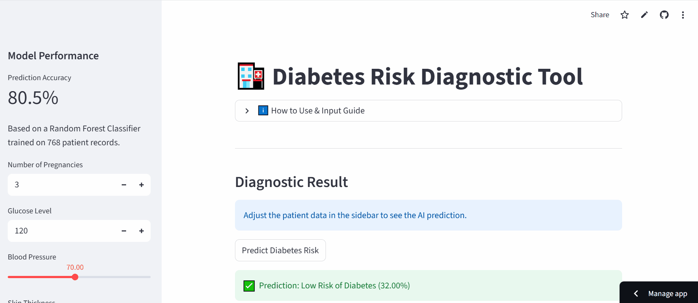

# 🩺 Diabetes Risk Diagnostic Tool

A professional, machine learning-powered web application built with **Python** and **Streamlit**. This tool uses a **Random Forest Classifier** trained on the Pima Indians Diabetes Database to predict the probability of diabetes based on clinical health metrics.

---

## 🚀 Live Demo
**[Click here to try the Live App](https://diabetes-risk-diagnostic.streamlit.app/)**

---

## 📺 Demo Preview


---

## ✨ Features
* **Interactive Sidebar:** Adjustable sliders and input fields for real-time data entry.
* **AI-Powered Predictions:** Instant probability scoring with clear "High Risk" or "Low Risk" feedback.
* **Data Visualization:** Interactive donut charts powered by `Plotly` showing training data distribution.
* **Downloadable Reports:** Generate and download a personalized `.txt` diagnostic report of the results.
* **Model Transparency:** View accuracy metrics and model evaluation details (Confusion Matrix) directly in-app.

## 🛠️ Tech Stack
* **Language:** Python 3.13
* **Framework:** Streamlit (Web UI)
* **Machine Learning:** Scikit-learn (Random Forest)
* **Data Handling:** Pandas & NumPy
* **Visualization:** Plotly Express
* **Deployment:** Streamlit Community Cloud

## 🚀 Installation & Local Setup

1. **Clone the repository:**
   ```bash
   git clone [https://github.com/ali-faraz-py/DiabetesDetector.git](https://github.com/ali-faraz-py/DiabetesDetector.git)
   cd DiabetesDetector


2. **Install dependencies:**
    ```bash
    pip install -r requirements.txt


3. **Run the application:**
    ```bash
    streamlit run app.py

## 📂 Project Structure

```text
DiabetesDetector/
├── app.py              # Streamlit Web Application logic
├── model.pkl           # Pre-trained Random Forest Model
├── explore.ipynb       # Data analysis & model training notebook
├── requirements.txt    # Project dependencies
├── .gitattributes      # GitHub language customization
└── assets/             # Images & Demo GIFs
```

## 🧠 Model Insights
The model achieves an **80.5% accuracy** rate. Below is the **Confusion Matrix** showing how the model performs on unseen data:


*The matrix shows our model is particularly strong at identifying healthy patients, with a focus on reducing false negatives.*

---

### 👤 Author
**Syed Ali Faraz** - [GitHub Profile](https://github.com/ali-faraz-py)

*If you found this tool insightful, please give the repository a ⭐!*