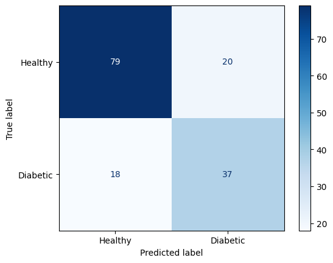

# 🩺 Diabetes Risk Diagnostic Tool

A machine learning-powered web application that estimates diabetes risk from clinical health metrics, built with a **FastAPI** backend and a **Next.js** frontend. Originally a Streamlit app, rebuilt into a full separate backend/frontend architecture.

---

## 🚀 Live Demo
**[Try the live app](https://diabetes-detector.vercel.app/)**

---

## ✨ Features
* **AI-powered predictions** — a **Random Forest Classifier** (scikit-learn) trained on the Pima Indians Diabetes Database estimates risk from 8 clinical inputs.
* **Population comparison** — each input shows the dataset's actual average alongside your entry, for context.
* **Session history** — every check you run stays visible in a running list for the current session.
* **Downloadable report** — generates a plain-text summary of your inputs and result.
* **Location-aware doctor recommendation** — if a result reads High Risk, a button finds nearby endocrinologists (Oladoc in Pakistan, Google Maps elsewhere), based on your browser's location.
* **Animated ECG pulse visual** — a live-drawing heartbeat-style line that changes color depending on the result.

## 🛠️ Tech Stack
* **Backend:** FastAPI, scikit-learn, pandas, deployed on **Render**
* **Frontend:** Next.js (App Router, JavaScript, Tailwind CSS), deployed on **Vercel**
* **Model:** Random Forest Classifier, ~80.5% accuracy, trained on the Pima Indians Diabetes Database

## 🚀 Installation & Local Setup

### Backend

    cd backend
    python -m venv venv
    venv\Scripts\Activate.ps1
    pip install -r requirements.txt
    uvicorn app.main:app --reload

Runs at `http://127.0.0.1:8000`.

### Frontend

    cd frontend
    npm install
    npm run dev

Runs at `http://localhost:3000`. Requires a `.env.local` file containing:

    NEXT_PUBLIC_API_URL=http://127.0.0.1:8000

## 📂 Project Structure

    DiabetesDetector/
    ├── backend/
    │   ├── app/
    │   │   ├── main.py          # FastAPI app: loads model, exposes /predict
    │   │   └── model.pkl        # Pre-trained Random Forest model
    │   └── requirements.txt
    ├── frontend/
    │   ├── app/
    │   │   ├── layout.js        # Fonts, metadata
    │   │   ├── page.js          # Main UI: form, pulse animation, results
    │   │   └── globals.css      # Design tokens (colors, fonts)
    │   └── package.json
    ├── Notebook/
    │   ├── explore.ipynb        # Data analysis & model training
    │   └── model.pkl
    ├── assets/
    │   ├── confusion_matrix.png
    │   └── DiabetesDetector.gif
    └── model.py                 # Alternate training script (Pipeline + scaler)

## 🧠 Model Insights
The model achieves **~80.5% accuracy**. Confusion matrix on held-out test data:

The model is particularly strong at correctly identifying healthy patients, with a focus on minimizing false negatives.

---

### 👤 Author
**Syed Ali Faraz** — [GitHub Profile](https://github.com/ali-faraz-py)

*If you found this tool insightful, please give the repository a ⭐!*